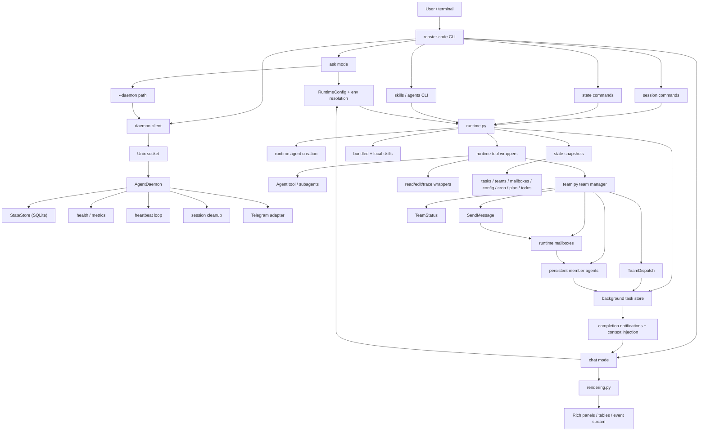

# Rooster Code

<!-- A CLI coding agent powered by Rich and Open Agent SDK -->

Rooster Code is a Rich-powered coding agent CLI built on Open Agent SDK.

## Implemented agentic features

Rooster Code currently includes:

- **ask** and **interactive chat** agent workflows for one-shot queries and persistent terminal sessions
- **session management** for listing, resuming, forking, renaming, tagging, and inspecting saved conversations
- **background agents and tasks** with notifications, task output inspection, waiting, and context injection on completion
- **multi-agent team orchestration** with team creation, non-blocking dispatch, team status, and inter-member messaging
- **named/custom agents** loaded from JSON agent definitions
- **skill invocation** through `/skills` and `/skill-name ...` chat commands, plus repo-local skill bundles from `skills/`
- **tool-gated execution** with allowed/disallowed tool controls and permission-mode support
- **MCP server integration** through SDK-backed MCP configuration
- **hooks-file passthrough** into the SDK runtime configuration
- **state inspection commands** for tasks, teams, mailboxes, config, cron, plans, and todos
- **manual session compaction** for trimming conversation history while preserving working context
- **long-running agent daemon** with Unix socket, session tracking, cost/token monitoring, heartbeat self-checks, and optional Telegram adapter
- **skills and agents CLI** — list available skills and configured agents from the terminal

> [!IMPORTANT]
> `open-agent-sdk` is **not published yet**. Right now the supported source is
> **cgycorey's fork**: `https://github.com/cgycorey/open-agent-sdk-python`.
>
> This repository currently expects the SDK as a **local sibling checkout** at
> `../open-agent-sdk-python` via `tool.uv.sources` in `pyproject.toml`.

## Environment

Rooster Code reads these env vars and passes them into the SDK explicitly:

- `ROOSTER_CODE_API_KEY`
- `ROOSTER_CODE_BASE_URL`
- `ROOSTER_CODE_MODEL`

## Install and run

### One-command bootstrap (recommended)

After cloning `rooster-code`, run:

```bash
./scripts/bootstrap.sh
```

What it does:

- clones **cgycorey's** `open-agent-sdk-python` into the required sibling path
  (`../open-agent-sdk-python`) if it is missing
- reuses the existing sibling SDK checkout if you already have one
- runs `uv sync` for this repo

This gives you the layout `pyproject.toml` already expects.

### Fresh setup from scratch

If you have not cloned `rooster-code` yet, this is the simplest flow:

```bash
git clone https://github.com/cgycorey/rooster-code
cd rooster-code
./scripts/bootstrap.sh
```

### Supported setup (manual)

Clone `rooster-code` and `open-agent-sdk-python` side by side so the existing
`uv` source override works without any edits:

```bash
git clone https://github.com/cgycorey/open-agent-sdk-python
git clone https://github.com/cgycorey/rooster-code

cd rooster-code
uv sync
```

Your directory layout should look like this:

```text
parent-dir/
├── rooster-code/
└── open-agent-sdk-python/
```

### If you already cloned `rooster-code` somewhere else

You still need the SDK checkout from cgycorey's repository:

```bash
git clone https://github.com/cgycorey/open-agent-sdk-python ../open-agent-sdk-python
uv sync
```

If you do not want the sibling layout, update `tool.uv.sources.open-agent-sdk`
in `pyproject.toml` to point at your local checkout before running `uv sync`.

### Run

```bash
uv run rooster-code --help
uv run rooster-code ask "Summarize this repository"
uv run rooster-code chat
```

## Primary commands

```bash
uv run rooster-code ask "Find the main entry point"
uv run rooster-code chat --model claude-sonnet-4-5
```

## Agent daemon

Rooster Code can run as a long-lived daemon process that accepts queries over a
Unix socket, tracks sessions in SQLite, monitors token usage and cost, and
optionally runs periodic self-checks via a heartbeat loop.

### Quick start

```bash
# Start the daemon (runs in foreground)
uv run rooster-daemon

# Start with a 30-minute heartbeat self-check
uv run rooster-daemon --heartbeat 1800

# Talk to the daemon from another terminal
uv run rooster-code ask --daemon "What does this repo do?"
uv run rooster-code daemon status
uv run rooster-code daemon sessions

# Graceful shutdown
uv run rooster-code daemon shutdown
```

### Daemon subcommands

```bash
uv run rooster-code daemon status         # Health, uptime, queries, tokens, cost, sessions
uv run rooster-code daemon sessions       # List tracked sessions
uv run rooster-code daemon session <id>   # Session detail (merged local + SDK metadata)
uv run rooster-code daemon shutdown       # Graceful stop
```

### `ask --daemon` mode

When the daemon is running, `ask --daemon` sends prompts to it instead of
creating a one-shot agent. The daemon handles session persistence, so you get
multi-turn conversations across invocations:

```bash
uv run rooster-code ask --daemon --session-id my-session "x = 42"
uv run rooster-code ask --daemon --session-id my-session "what is x?"
# → 42
```

All shared runtime flags work with `--daemon` (model, max-turns,
permission-mode, allowed-tools, thinking-budget, sandbox, debug, etc.).

### Heartbeat

The daemon can run periodic self-checks via `--heartbeat SECONDS`. Each pulse
queries the LLM to review daemon state and report findings. The heartbeat
session persists across pulses, accumulating context.

```bash
uv run rooster-daemon --heartbeat 1800   # Every 30 minutes
```

### Telegram adapter (optional)

```bash
uv sync --extra telegram
uv run rooster-daemon --telegram YOUR_BOT_TOKEN --telegram-allowed 123456789
```

### Daemon architecture

```
┌──────────────┐     Unix socket      ┌──────────────────┐
│  rooster-code │ ──── JSON-Lines ───→ │   AgentDaemon    │
│  CLI client   │ ←─── JSON-Lines ──── │  (asyncio)        │
└──────────────┘                      │                    │
                                      │  StateStore (SQLite)│
┌──────────────┐                      │  Health + metrics   │
│  Telegram    │ ──── aiogram ──────→ │  Heartbeat loop     │
│  adapter     │                      │  Cleanup loop       │
└──────────────┘                      └────────────────────┘
```

## Interactive chat commands

Rooster Code chat has a richer slash-command surface than the basic CLI help
suggests. The current interactive commands include:

- `/help` — show the command list
- `/clear` — clear the current agent history
- `/compact` — summarize the current chat history
- `/model <name>` — switch models
- `/permission <mode>` — update permission mode
- `/tools` — list available tools
- `/skills` — list available skills
- `/plan <args>` — invoke the local plan skill
- `/tasks` — show background tasks
- `/bg <name> <prompt>` / `/agent-bg <name> <prompt>` — start a background subagent task
- `/task-output <id>` — inspect task output
- `/task-stop <id>` — stop a background task
- `/wait <id>` — wait for a background task and inject its result into context
- `/sessions` — show saved sessions
- `/resume <session-id>` — resume a different session
- `/status` — show current runtime state
- `/agents` — list configured agents
- `/agents add <name> <desc>` — add an agent definition
- `/agents remove <name>` — remove an agent definition
- `/agents show <name>` — show an agent definition
- `/team create <name> <members...>` — create a team of configured agents
- `/team info` — show team status
- `/team stop` — disband the active team
- `/exit` — exit chat

## Workflow map

```mermaid
flowchart TD
    A["rooster-code CLI"] --> B["ask"]
    A --> C["chat"]
    A --> D["sessions"]
    A --> E["state"]
    A --> F["tools"]
    A --> G["skills"]
    A --> H["agents"]
    A --> DAEMON["daemon"]

    B --> B1["ask --daemon"]
    B1 --> DAEMON

    DAEMON --> D1["daemon status"]
    DAEMON --> D2["daemon sessions"]
    DAEMON --> D3["daemon session"]
    DAEMON --> D4["daemon shutdown"]
    DAEMON --> D5["heartbeat loop"]
    DAEMON --> D6["StateStore (SQLite)"]

    C --> C1["/help"]
    C --> C2["/model"]
    C --> C3["/permission"]
    C --> C4["/clear"]
    C --> C5["/compact"]
    C --> C6["/status"]
    C --> C7["/exit"]

    C --> S["/skills"]
    S --> S1["/plan"]
    S1 --> S2["skills/plan/SKILL.md"]

    C --> BG["/bg or /agent-bg"]
    BG --> BG2["background task store"]
    BG2 --> BG3["/tasks"]
    BG2 --> BG4["/task-output"]
    BG2 --> BG5["/task-stop"]
    BG2 --> BG6["/wait"]

    C --> AG["/agents"]
    AG --> AG1["/agents add"]
    AG --> AG2["/agents show"]
    AG --> AG3["/agents remove"]

    C --> T["/team"]
    T --> T1["/team create"]
    T --> T2["TeamDispatch"]
    T --> T3["SendMessage"]
    T --> T4["TeamStatus"]
    T --> T5["/team info"]
    T --> T6["/team stop"]

    E --> E1["state tasks"]
    E --> E2["state teams"]
    E --> E3["state mailboxes"]
    E --> E4["state config"]
    E --> E5["state cron"]
    E --> E6["state plan"]
    E --> E7["state todos"]
```



## Internal architecture



## Skills

Rooster Code supports user-invocable SDK skills and also loads repo-local skill
bundles from `skills/` when present.

Current repo-local skill bundle:

- `plan` — defined in `skills/plan/SKILL.md`

Interactive usage examples:

```text
/skills
/plan add auth support
```

## Session management

```bash
uv run rooster-code sessions list
uv run rooster-code sessions show <session-id>
uv run rooster-code sessions info <session-id>
uv run rooster-code sessions fork <session-id> --new-id <new-session-id>
uv run rooster-code sessions rename <session-id> "My session"
uv run rooster-code sessions tag <session-id> alpha beta
uv run rooster-code sessions append <session-id> "message text" [--role <role>]
uv run rooster-code sessions delete <session-id>
```

Supported roles: `user` (default), `system`, `assistant`, `tool`. Unknown roles
are accepted and stored as-is.

## Skills and agents (CLI)

List available skills and configured agents without entering chat mode:

```bash
uv run rooster-code skills            # List all available skills
uv run rooster-code skills --json      # JSON array output
uv run rooster-code agents list        # List configured agents
```

## Tools and state inspection

```bash
uv run rooster-code tools list
uv run rooster-code state tasks
uv run rooster-code state teams
uv run rooster-code state mailboxes
uv run rooster-code state mailboxes --agent reviewer
uv run rooster-code state config
uv run rooster-code state cron
uv run rooster-code state plan
uv run rooster-code state todos
```

## Background tasks and agents

Background delegation is a first-class workflow:

```text
/bg reviewer inspect the latest commit
/agent-bg reviewer inspect the latest commit
/wait task_1
/task-output task_1
/task-stop task_1
```

Completed background task results are surfaced in chat and can be injected back
into the active conversation context when you wait on them.

## Team workflows

Rooster Code has an in-process team runtime built around configured agent
definitions. Team workflows support:

- team creation from configured agents
- non-blocking `TeamDispatch`
- `TeamStatus`
- inter-member `SendMessage`
- SDK-visible runtime team/mailbox snapshots through `state teams` and
  `state mailboxes`

Example interactive flow:

```text
/agents add reviewer reviews code carefully
/agents add builder builds features
/team create dev-team reviewer builder
/team info
/team stop
```

## Shared runtime flags for ask/chat

```bash
uv run rooster-code ask "Review src" \
  --model claude-sonnet-4-5 \
  --cwd /home/kali/rooster-code \
  --resume existing-session \
  --allowed-tool Read \
  --disallowed-tool Bash
```

Supported shared flags:

- `--daemon` — route through long-running daemon (requires daemon running)
- `--cwd`
- `--model`
- `--permission-mode`
- `--max-turns`
- `--max-budget-usd`
- `--max-tokens`
- `--thinking-budget`
- `--allowed-tool`
- `--disallowed-tool`
- `--session-id`
- `--resume`
- `--continue-session`
- `--fork-session`
- `--persist-session` / `--no-persist-session`
- `--sandbox`
- `--debug`
- `--include-partials`
- `--env KEY=VALUE`
- `--custom-header KEY=VALUE`
- `--extra-args-file`
- `--json-schema-file`
- `--agents-file`
- `--hooks-file`
- `--mcp-file`

JSON-backed options expect a file path whose contents can be loaded directly into the corresponding SDK option.
